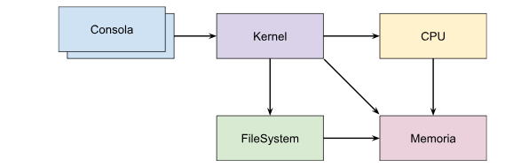

# Definicion
Consiste de 5 módulos: Consola (múltiples instancias), Kernel, CPU, Memoria y File System (1 instancia cada uno).

## Arquitectura

## Consola
El mismo consiste en crear procesos a través del módulo Consola, los cuales envían la información necesaria al módulo Kernel 

## Kernel 
Crea las estructuras necesarias a fin de administrar y planificar su ejecución mediante diversos algoritmos. Una vez que un proceso finalice tras haber sido ejecutadas todas sus instrucciones, el Kernel devuelve un mensaje de finalización a su Consola correspondiente y cierra la conexión.

## CPU
Estos procesos son ejecutados en el módulo CPU, quien interpreta  sus instrucciones y hace las peticiones necesarias a Memoria y/o al Kernel.

## Memoria
La Memoria administra el espacio de memoria (valga la redundancia) de estos procesos implementando un esquema de segmentación y respondiendo a las peticiones de CPU, Kernel y File System.

## File System
Implementa un esquema indexado, tomando algunas características de un File System tipo Unix o ext2. El mismo está encargado de administrar y persistir los archivos creados por los procesos que corren en el sistema, respondiendo a las peticiones de Kernel y haciendo las peticiones necesarias a Memoria

